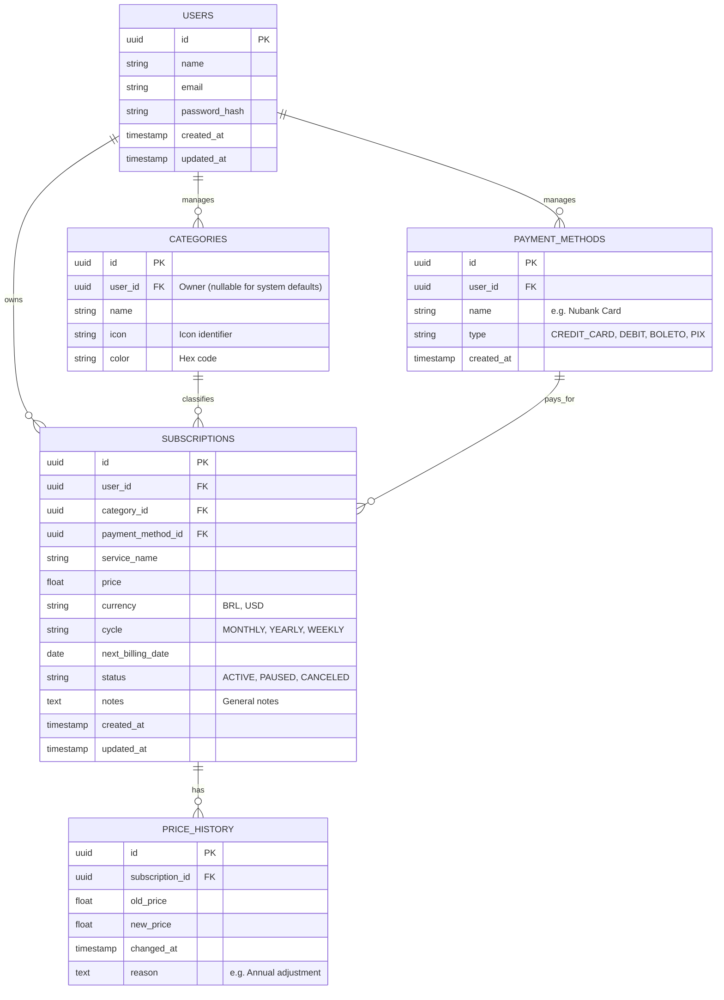

# Database Design

This document serves as the source of truth for the database schema.
We use Mermaid to visualize the relationships before implementing them in Go/SQL.

## Entity Relationship Diagram (ERD)

## Implementation Plan
1. Define entities in `application/domain`.
2. Create migration scripts in `infra/database/migrations`.
3. Implement Repositories in `infra/database/repositories`.
