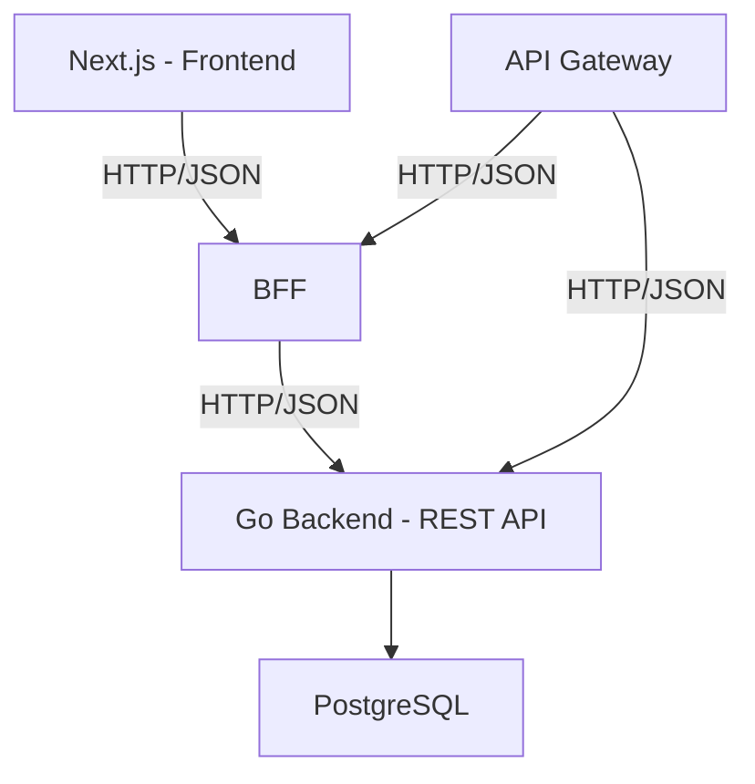

# SubWatch

SaaS para controle de assinaturas e gastos recorrentes, desenvolvido com Next.js (App Router) no frontend e Golang no backend, aplicando práticas modernas de arquitetura, testes e observabilidade.

---

## 🧠 Visão Geral

O SubWatch permite que usuários cadastrem e acompanhem seus gastos recorrentes (assinaturas, mensalidades, serviços, cursos, etc.) e visualizem:

- Total gasto por mês e por ano
- Gastos por categoria e forma de pagamento
- Próximas cobranças
- Simulação de economia ao cancelar assinaturas

O foco do projeto não é apenas a feature, mas sim:

- Arquitetura limpa
- Uso avançado do Next.js
- Backend robusto em Go
- Estratégias reais de testes (unit, integration e e2e)

---

## 🎯 Objetivo do Projeto

Este projeto foi criado como desafio técnico pessoal e portfólio profissional, com os seguintes objetivos:

- Demonstrar domínio de Next.js moderno (App Router)
- Construir um backend em Go bem estruturado
- Trabalhar como em um produto real (frontend + backend + banco)
- Aplicar testes em múltiplos níveis
- Mostrar capacidade de tomada de decisão arquitetural

---

## 🏗 Arquitetura Geral

### Representação em texto

```
┌─────────────┐ HTTP/JSON ┌──────────────┐
│   Next.js   │ ─────────▶ │ Go Backend  │
│ (Frontend)  │           │   REST API   │
└─────────────┘           └───────┬──────┘
                                   │
                                   ▼
                            ┌─────────────┐
                            │ PostgreSQL  │
                            └─────────────┘
```

### Representação em Mermaid



- **Frontend**: Next.js (App Router)
- **BFF**: Backend for Frontend, intermediário entre o Next.js e o backend principal
- **Backend**: Go (REST API)
- **API Gateway**: Camada de roteamento e abstração para comunicação entre serviços
- **Banco**: PostgreSQL
- **Comunicação**: HTTP/JSON

---

## 🧩 Stack Tecnológica

### Frontend

- Next.js (App Router)
- TypeScript
- React Server Components
- Server Actions
- Tailwind CSS
- shadcn/ui
- Zod (validação de formulários)
- Playwright (E2E)
- Vitest + Testing Library (unit/integration)

### Backend

- Go 1.22+
- chi (HTTP router)
- PostgreSQL
- Migrations: golang-migrate ou goose
- ORM / DB Layer: sqlc ou gorm
- Validação: go-playground/validator
- Logs: zap ou zerolog
- Docker & Docker Compose

### API Gateway

- Go 1.22+
- gorilla/mux (roteamento)
- Docker & Docker Compose
- Configuração centralizada de rotas

---

## 📁 Estrutura do Repositório

```plaintext
.
├─ frontend/ # Aplicação Next.js
├─ backend/  # API em Golang
├─ bff/      # Backend for Frontend
├─ api-gateway/ # API Gateway
├─ docs/     # Documentação
└─ README.md
```

---

## 🧭 Backend — Organização

```plaintext
backend/
├─ cmd/
│   └─ api/
│       └─ main.go
├─ internal/
│   ├─ http/
│   │   ├─ router.go
│   │   └─ handlers/
│   ├─ subscription/
│   │   ├─ model.go
│   │   ├─ repository.go
│   │   └─ service.go
│   ├─ dashboard/
│   ├─ db/
│   │   ├─ postgres.go
│   │   └─ migrations/
│   └─ config/
└─ tests/
```

### Responsabilidades

- **Handlers**: HTTP, parsing de request/response
- **Services**: regras de negócio
- **Repositories**: acesso a dados
- **Models**: domínio puro
- Separação clara entre transporte e domínio

---

## 🧭 Frontend — Organização

```plaintext
frontend/
├─ app/
│   ├─ (marketing)/
│   │   └─ page.tsx
│   ├─ (app)/
│   │   ├─ layout.tsx
│   │   ├─ dashboard/
│   │   │   ├─ page.tsx
│   │   │   └─ loading.tsx
│   │   ├─ subscriptions/
│   │   │   ├─ page.tsx
│   │   │   ├─ [id]/page.tsx
│   │   │   └─ @modal/(.)new/page.tsx
│   └─ middleware.ts
├─ src/
│   ├─ lib/
│   ├─ components/
│   ├─ schemas/
│   └─ tests/
└─ playwright/
```

---

## 🚀 Features do Next.js Utilizadas

- ✅ App Router
- ✅ React Server Components
- ✅ Server Actions
- ✅ Nested Layouts
- ✅ Loading UI com Suspense
- ✅ Parallel & Intercepting Routes (modais)
- ✅ Middleware para proteção de rotas
- ✅ SEO com generateMetadata
- ✅ Streaming de dados

---

## 🧪 Estratégia de Testes

### Backend (Go)

- **Unit Tests**
  - Serviços de domínio
  - Regras de cálculo
- **Integration Tests**
  - API HTTP real (httptest)
  - PostgreSQL de teste
  - Testes independentes de framework

### Frontend (Next.js)

- **Unit / Component Tests**
  - Componentes reutilizáveis
  - Funções puras
- **Integration Tests**
  - Fluxos com formulários
  - Validação + submissão
- **E2E (Playwright)**
  - Front + Backend + DB reais
  - Fluxos completos do usuário

---

## 🔐 Autenticação (escopo inicial)

Autenticação simples baseada em:

- JWT ou
- Sessão via cookies (web-friendly)

Middleware no Next para proteção de rotas privadas

---

## 🐳 Infraestrutura

- **Docker Compose**
  - PostgreSQL
  - Backend Go
  - Frontend Next
  - API Gateway
- Variáveis de ambiente centralizadas
- Pronto para rodar localmente com um comando:

```bash
docker-compose up -d
```

---

## 🗺 Roadmap

1. Setup do backend Go
2. CRUD de subscriptions
3. Dashboard backend (summary)
4. Integração com Next.js
5. UI base (dashboard + lista)
6. Formulários via Server Actions
7. Testes unit e integration
8. Testes E2E
9. Adicionar API Gateway
10. Polish visual e README final

---

## 📌 Por que este projeto importa?

Este projeto demonstra:

- Pensamento de produto
- Domínio de front-end moderno
- Capacidade de construir backend sólido
- Experiência com testes reais
- Decisão consciente de arquitetura e trade-offs

---

## 🧑‍💻 Autor

### João Paulo Duarte

Frontend Engineer | Full Stack curious

- Next.js • Golang • Architecture • Testing
